<h4 align="left"> Spark Web UI 详解 </h4>

---------------

- [Jobs]()
  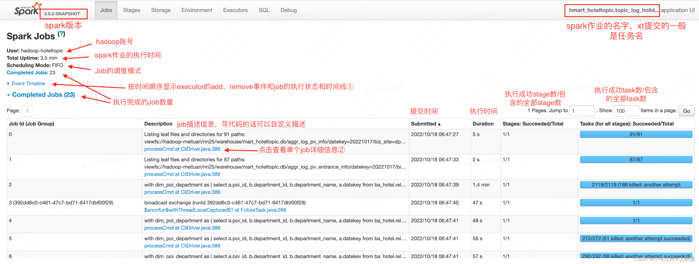
  ```.text
   User：hadoop账号，和登录hope时需要的User相同
   Total Uptime：spark作业的执行时间，完成的作业=结束时间➖开始时间，进行中的作业该值会随着刷新在改变。该时间不是所有job的执行时间之和（有并行的job，job与job之间也有时间间隔），也不是最后一个job的结束时间➖第一个job的提交时间（作业启动到job提交之前还有一些时间）
   Scheduling Model：Job的调度模式，分为FIFO（先进先出）和FAIR（公平调度）。可以并行的Job，FIFO是谁先提交谁先执行可以理解为JobId小的先执行。FAIR会根据权重决定哪个Job先执行
  ```
    - [Event Timeline]()
      > 点击Event Timeline后可以看到以下信息: <br>
      
      > 时间线会显示Executor加入和退出的时间点, 以及job执行的起止时间.
    - [Jobs Detail]()
      > 点击Event Timeline后可以看到以下信息: <br>
      
      ```.text
       Status：job的执行状态(running, succeeded, failed)
       Associated SQL Query：关联到sql页签的query id，点击可以跳到SQL页签具体的query
       Number of stages per status ：(active, pending, completed, skipped, failed)状态下的stage数量
       Event timeline: 和Jobs中的相同
       DAG Visualization：DAG（directed acyclic graph），有向无环图，显示该job下执行的stage的可视化图，其中顶点表示RDDs或DataFrames，边表示要应用于RDD的操作。
      ```
      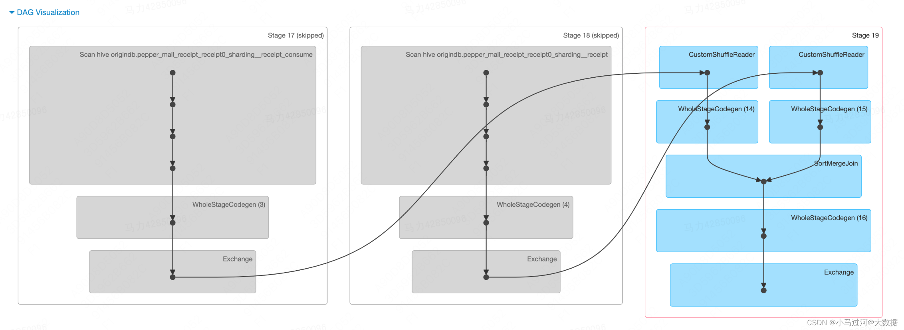


- [Stages]()
  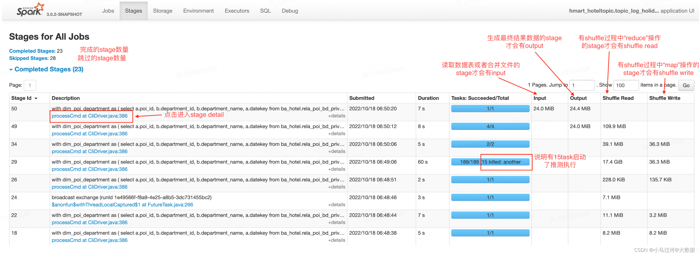
  ```.text
   stage页签展示了所有job下的所有的stage，如果是在执行中的作业，只展示已经启动的stage
   Input：指真正读取的文件大小，如果表是分区表，则代表读取的分区文件大小。如果数据表有10个字段，只select了3个字段并发生了列裁剪，则Input表明是3个字段的存储大小。
   Output：输出到hdfs上的文件大小，如果结果数据是压缩的，则代表压缩后的大小。
   Shuffle Read：shuffle阶段读取的数据大小，既包含executor本地的数据，也包含从远程executor读取的数据。
   Shuffle Write：为了shuffle所准备的数据，未来会有其他的stage来读取，该部分数据会写到磁盘上。
  ```
    - [关于stage列表页的场景问题]()
      > stage是如何划分的？<br>
      ```.text
       标准的回答是按照宽依赖划分stage
       从实践中我总结的stage划分的原则是：有shuffle操作，且shuffle的key不相同（类型不相同也算）则新开stage，否则合并到前一个stage中
      ```
      > 如何识别出stage的依赖关系？<br>
      ```.text
       一般来说按照submitted进行排序，时间相同stage代表是并行执行的，相互之间没有依赖关系。时间相近且前一个stage的提交时间+执行时间>后一个stage的提交时间，两者也是没有依赖关系。
       有依赖关系的stage往往有这样的特征：1.前一个stage的提交时间+执行时间＝（或小于）后一个stage的提交时间，2.前一个stage的shuffle write数据量等于后一个stage的shuffle read数据量，或者后一个stage的read数据量=前两个stage的write数据量之和。 
       除了在列表页的推测判断外，还可以在sql页面看整个作业的DAG图
      ```
      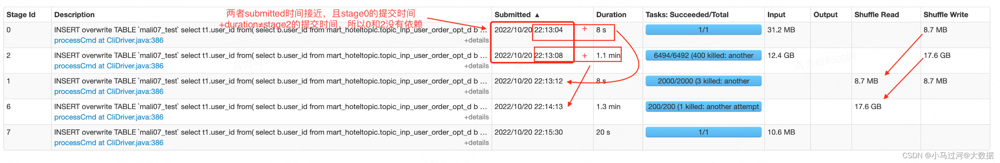
      > 有的stage名叫Listing leaf files and directories for xxx paths是什么意思? <br>
      ```.text
       spark 作业在启动前会从文件系统中查询数据的元数据并将其缓存到内存中，元数据包括一个 partition 的列表和文件的一些统计信息（路径，文件大小，是否为目录，备份数，块大小，定义时间，访问时间，数据块位置信息）。
       一旦数据缓存后，在后续的查询中，表的 partition 就可以在内存中进行下推，得以快速的查询。将元数据缓存在内存中虽然提供了很好的性能，但在 spark 加载所有表分区的元数据之前，会阻塞查询。对于大型分区表，递归的扫描文件系统以发现初始查询文件的元数据可能会花费数分钟。
       后来，spark在读取数据时会先判断分区的数量，如果分区数量小于等于spark.sql.sources.parallelPartitionDiscovery.threshold (默认32)，则使用 driver 循环读取文件元数据，如果分区数量大于该值，则会启动一个 spark job，并发的处理元数据信息(每个分区下的文件使用一个task进行处理)。
       分区数量很多意味着 Listing leaf files task 的任务会很多，分区里的文件数量多意味着每个 task 的负载高。
      ```
      
      > 有些任务spark.sql.shuffle.partitions设置为2000，为什么有的stage的task数量是4000? <br>
      ```.text
       比如下面的任务设置spark.sql.shuffle.partitions=2000;但是却有一个stage做了shuffle操作，有4000个task
      ```
      
      ```.text
       推测的原因是这个stage对应的是以下面的代码，上下两个shuffle的key相同又有一次union all，所以可以放在一个stage中，
       虽然task数量是4000，但是上面的shuffle数据是分在2000个task中，下面的是另一个2000task中，并不会两者合在一起hash到4000个task中。
      ```
      
      > 有的stage会显示xxtask failed，代表什么意思呢，为什么task失败stage不会失败呢 ? <br>
      
      ```.text
       如上图，某些stage除了会显示总的task数，执行成功task数和killed task数，还会显示failed task数。failed task数量就代表该stage中执行失败的task数量。
       为什么task失败而stage不会失败，是因为spark有一系列的重试机制来为分布式下大量任务的容错。
       1）application层面的容错：spark.yarn.maxAppAttempts
       代表一个app会最多执行几次，如果设置的是3就代表失败后会重试2次，公司当前设置的是1，即不会重试。（注意：spark框架下一个app不会多次重试，但是cantor会有两次重试机会）
       2）stage层面的容错：spark.stage.maxConsecutiveAttempts
       代表一个stage连续执行失败几次会被中止，社区版默认设置为4，公司的没有显式的指定
       3）task层面的容错：spark.task.maxFailures
       代表一个task连续执行失败几次会被中止，社区版默认设置为4，公司的没有显式的指定，印象中也是4。
       4）某些动作层面的容错
       比如spark.shuffle.io.maxRetries、spark.rpc.numRetries用来容错shuffle时的io异常和rpc通信的异常，类似的参数非常多，不一一列举，可以通过在spark参数中搜索attempt、failures、retries等看到
      ```
    - [Stage detail]()
      > stage detail下展示了单个stage的信息，是排查有问题的stage时最重要的页面 <br>
      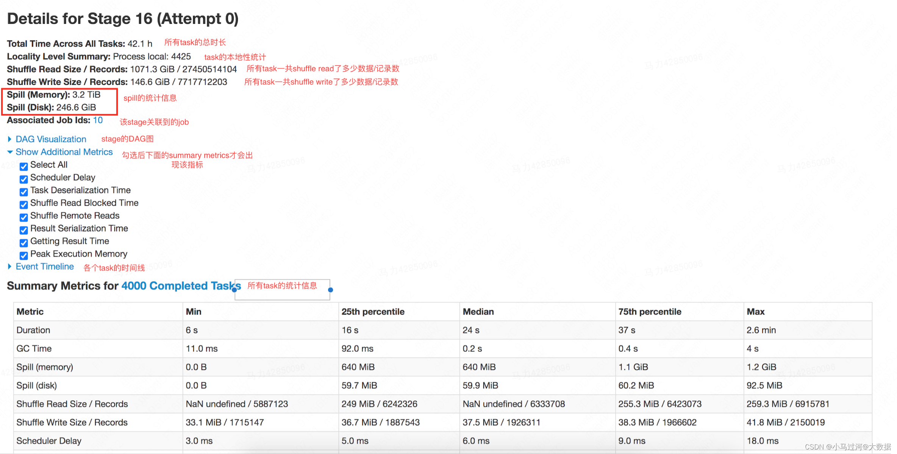
        - [Locality level]()
          ```.text
           描述spark task的本地性级别。简单说计算越靠近数据本身，速度越快，所以通常情况下，会把代码发送到数据所在节点，而不是把数据拉取到代码所在节点。本地性有5个级别，分别是PROCESS_LOCAL（在相同进程中）、NODE_LOCAL（在相同节点）、NO_PREF（没有位置偏好，从哪里访问都一样快）、RACK_LOCAL（在相同的机架上）、ANY（在其他网络节点上），数据和计算的距离是越来越远，速度也越来越慢。
          ```
        - [Event Timeline]()
          ```.text
           task的时间线，以条形图+不同颜色的方式描述了各个task的不同动作下的耗时，鼠标浮动到某个条形图上，可以看到该task具体的各项时间。
          ```
          
          ```.text
           spark官网对于界面上各个指标的简单介绍如下:
           Getting result time is the time that the driver spends fetching task results from workers.（driver获取结果的时间，我们的ETL中几乎没有结果需要返回driver的情况，可以不关注）
           Scheduler delay is the time the task waits to be scheduled for execution.（调度延迟，sparkui上说如果调度延迟过长可以考虑减少task的大小或者结果的大小。具体原理不明）
           Executor Computing Time: 表示Task 执行时间，但不包含读取数据后的反序列化时间，和结果的序列化时间。
           Result serialization time is the time spent serializing the task result on a executor before sending it back to the driver.（结果序列化的时间）
           Task Deserialization Time：Time spent deserializing the task closure on the executor, including the time to read the broadcasted task.（从远端或广播读取到的数据进行反序列化的时间）
           Shuffle Read Time ：shuffle时从远端读取数据的时间
           Shuffle Write Time ：shuffle前进行shuffle写的时间
          ```
        - [Summary Metrics]()
          > 此处是所有task的统计信息 <br>
          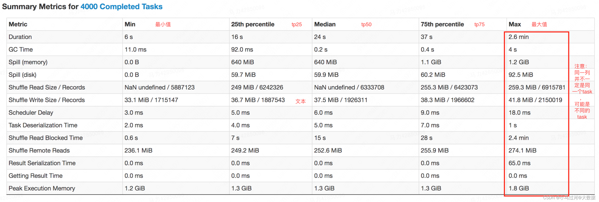
          ```.text
           除了上面Timeline中出现的指标，其他指标的基本也是见名知意的，这里不再赘述。通常情况下排查数据倾斜或者某个task处理时间过长需要重点关注下面几个指标
           Duration：task的执行时长，如果不同task之间的Duration差异过大，或者某个task的Duration过长，需要重点看看，可能是倾斜引起。
           Input Size / Records：task的输入数据量，如果不同task之间的Input Size差异过大，考虑是否有输入的数据倾斜。
           Shuffle Read Size / Records：task的shuffle read数据量，如果不同task之间的shuffle read差异过大，考虑是否有shuffle的输入数据倾斜
           Shuffle Write Size / Records：task的shuffle write数据量，如果不同task之间的shuffle erite差异过大，考虑是否有shuffle的输出数据倾斜（数据膨胀）
           Shuffle Read Blocked Time：task在读取数据是的阻塞时长，也是目前非rss任务经常出现的过长的问题，该时间过长可以考虑迁移到rss上
           Spill (memory)/(disk)：task 溢出的数量，memory指的是溢出前没有序列化的大小，disk指的是序列化为字节码的大小，也是占用磁盘的空间大小。最好是控制task不要产生溢出，大量溢出会消耗大量的时间
           GC Time：task运行时垃圾回收的时间，越短越好，如果过大，考虑是不是task中处理了大对象比如复合类型的字段或者超长的string字段。
          ```
        - [Aggregated Metrics by Executor]()
          
          ```.text
    
          ```
        - [Tasks]()
          > 每个task的明细信息，显示的指标受“Show Additional Metrics”中勾选的指标多少，在executor和task模块下都可以通过点击Logs来看executor的日志 <br>
          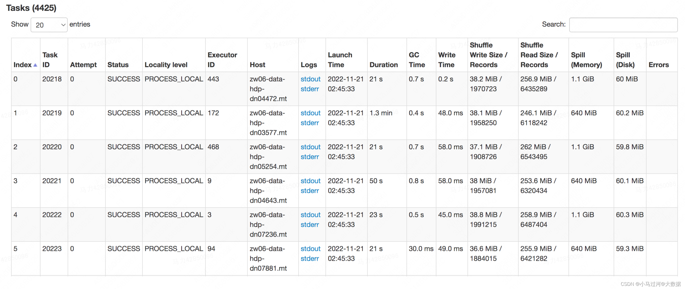
    - [关于stage detail的问题]()
      > 为什么一般spill disk要小于spill memory ？<br>
      ```.text
       因为一个java的对象、字符串、集合类型在内存中为了更快的访问，都存储了超量的信息。比如一个对象需要存储，对象头存储信息，和对齐填充，一般来说即使是一个空对象，
       也需要占用对象头12-20字节。而序列化之后则不用存储这些内容。另外序列化也是一个重新的编码，也会起到“压缩”的效果
      ```
      > 为什么要序列化 ？<br>
      ```.text
       因为两个进程在进行远程通信时，都会以二进制序列的形式在网络上传送。无论是何种类型的数据，发送方需要把这个Java对象转换为字节序列，才能在网络上传送；接收方则需要把字节序列再恢复为Java对象。
      ```
      > 为什么有的task只有spill memory没有spill disk，或者只有spill disk没有spill memory ？<br>
      ```.text
       个人推测是统计信息的采样丢失引起的，两者应该是同时存在或不存在
       Shuffle Read Size和 Shuffle Remote Reads是什么关系，为什么有时前者会比后者小
      ```
      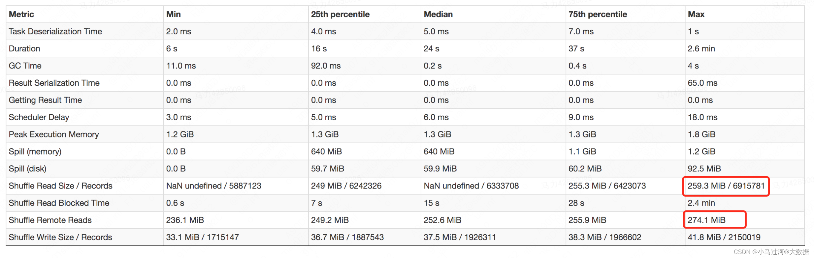
      ```.text
       理论上说Shuffle Read Size包含了local read和remote read，所以Shuffle Read Size应该永远比Shuffle Remote Reads要大。
       个人推测在summary metrics中可能是统计信息丢失或者有误，会出现前者小于后者的情况，建议以task明细为准
      ```
      

      > GC Time时间过长，有没有什么好办法 ？<br>
      ```.text
       通常情况下gc时间不应该过长，如果出现gc过长首先应该找到gc耗时久的原因，对因下药解决。
       也有一些对症下药的通用办法，比如增加executor的内存或者调整spark.memory.fraction参数增大执行内存，再或者可以更换垃圾回收器
      ```

- [Storage]()
  ```.text
   storage页面展示spark任务在执行过程中persist或者catche的RDD状态信息，由于这部分RDD只会在执行过程中出现，所以一个任务一旦执行完毕这个页面就不会在显示信息。
   对于数仓同学来说，这个页面比较少的关注，也基本不起到什么作用，可以只作为知识了解即可。
  ```
  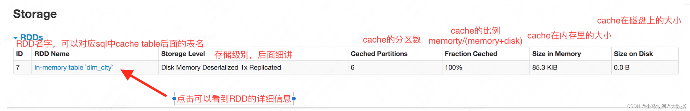
  > 点击具体的RDD后，可以看到下面的详细信息 <br>
  
    - [关于storage页面的问题]()
      > StorageLevel都有哪些 ？<br>
      ```.text
       具体含义可以看下面的截图，大致分为内存对象、内存和磁盘、内存序列化、内存和磁盘序列化、磁盘、双副本、堆外内存。
       通常情况下，在内存对象和内存序列化访问速度最快。
      ```
      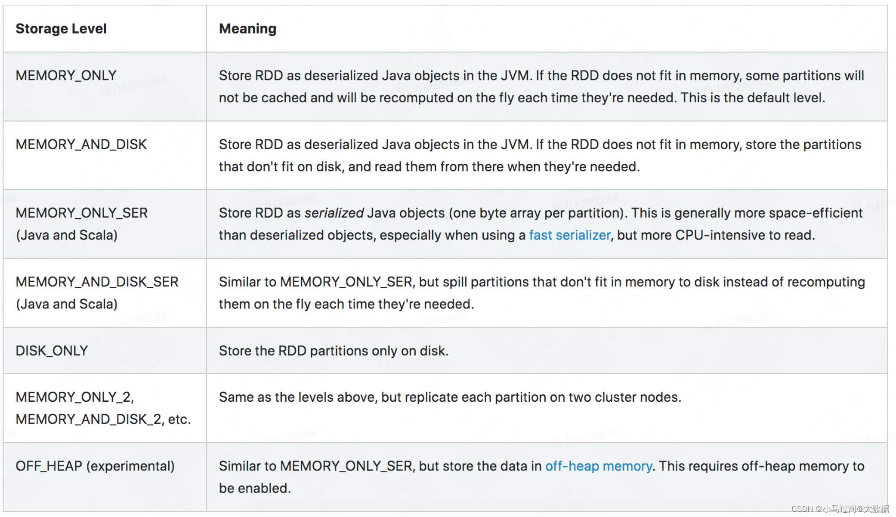
      ```.text
       至于为什么RDD的StorageLevel是Disk Memory Deserialized 1x replicated，而RDD partition的StorageLevel是Memory Deserialized 1x/2x/3x replicated，上下不一致的原因还不是很清楚。
      ```
      > cache table有什么用，和broadcast有什么关系或者区别吗 ？<br>
      ```.text
       首先cache table和broadcast join并没有绝对的关系。
       cache table是把数据缓存在内存（绝大部分情况）或本地磁盘上，适用的场景主要是缓存一段“反复使用的逻辑的结果”。比如我们经常写的with xxx as是把一段逻辑封装成一个虚拟表，但是真正在计算时，
       多次引用会多次触发这段逻辑计算，所以只是写起来精简，但执行上并没有一次运行多次复用。使用了cache table则能把这段逻辑的结果进行缓存，后面代码在引用时不会重新计算这段逻辑生成结果，实现了一次计算多次复用。
       有时我们使用create [temporary] table来固话一段逻辑的结果也可以实现类似的效果，只不过cache table大多在内存中，访问速度会非常快，非常适合内存中的迭代计算。
       由于cache table多是缓存在内存中，数据量一般很小，很大概率会小于参数spark.sql.autoBroadcastJoinThreshold设置的值，因而触发了自动的广播。
      ```

- [Environment]()
  ```.text
   Environment页面主要展示了spark作业在执行时的各类环境或框架的参数设置，如果想查看一个任务执行时真实生效的参数设置，可以在该页面查看（某些参数是xt默认提交，有些是集群默认设置，有些是spark hbo的自动调整等，都会和xt模板里人工设置的参数有所不同）。
   有时我们在xt模板里设置的参数错误（比如参数后面用中文“；”而不是英文“;”，比如参数的“=”两边有空格，都会造成设置的参数不生效），所以当实际执行结果和预期不符时在这个页面check下是有必要的。
  ```
  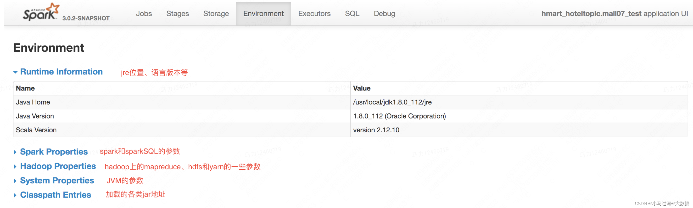
  > 我们需要关注的最重要的是Spark Properties部分，少量情况也可以看看Hadoop Properties部分，具体可以看看官
  > 网和我整理的核心参数 <br>
    - [Spark里的配置参数（官网）](https://spark.apache.org/docs/3.0.0-preview2/configuration.html)


- [Executors]()
  ```.text
   executors页面展示了executor和driver的一些统计信息和明细信息，汇总信息包括内存、磁盘、cpu的使用量，任务执行时间、GC时间，成功、失败、完成的task数量，以及输入输出的数据量等内容。
   明细信息除了和汇总信息相同的内容，还有每个executor和driver的日志信息。需要注意的是，这个页面中显示的内存使用和executor状态信息都是瞬时值，任务在执行过程中会一直变化，任务执行结束内存指标都会清零。
  ```
  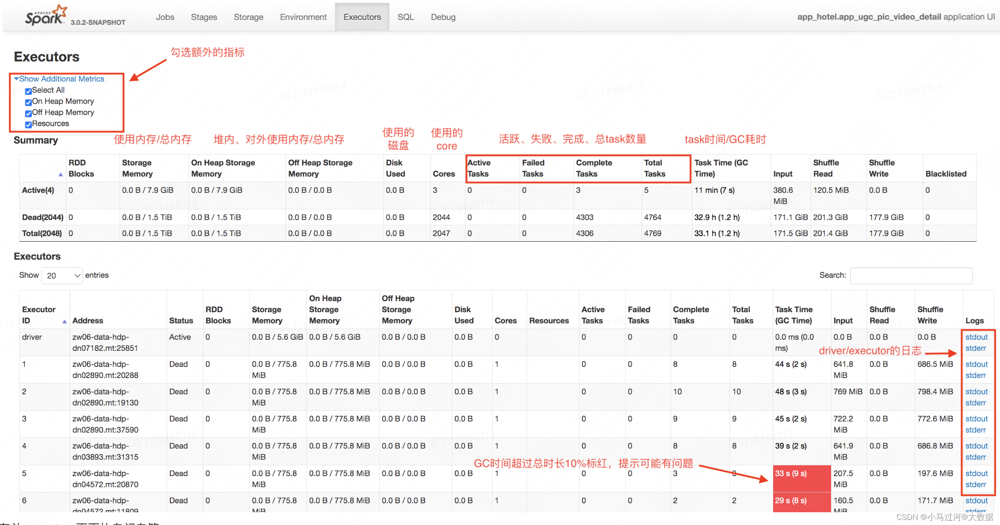

    - [关于Executors页面的问题]()
      > executor和driver到底是什么东西 ？<br>
      ```.text
       executor和driver并不是物理上的机器，而是宿主在机器上的跑在jvm上的进程，这点从address也可以看出（机器名+端口号）
      ```
      > storage memory中的总内存数代表什么意思，又是如何计算得出的呢？<br>
      ```.text
       SparkUI的Executor页面上有个storage memory指标，好奇这个指标的数值代表什么含义，是如何被精确计算的?
      ```
      
      ```.text
       storage memory，虽然名字看起来是存储内存的大小，但实际上由于spark1.6之后已经实现了统一内存管理（即执行内存和存储内存使用同一个统一内存），所以storage memory实际上是统一内存的大小，
       是sparkSQL中我们设置spark.executor.memory和spark.memory.fraction，在jvm中能够被用来计算和存储的内存。如下图红圈部分是storage memory的范围。
      ```
      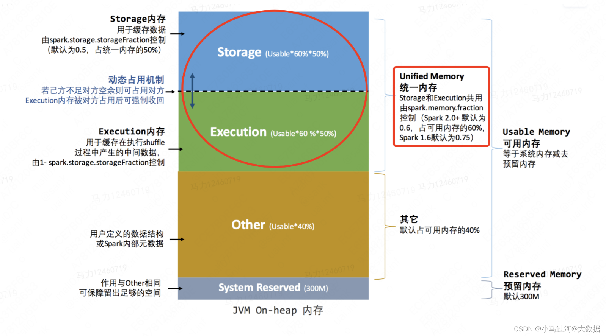
      > 以下面参数设置为例 <br>
      ```.text
       SET spark.executor.memory=1792M;
       SET spark.memory.fraction=0.6;
       按照上图的结构，可以得出storage memory=（spark.executor.memory-300）*spark.memory.fraction=（1792-300）*0.6=895.2，这个数值和sparkui上的775.8是有不小的差距的。'
       深入研究后发现，实际上jvm的堆内存管理存在YoungGen（新生代）和OldGen（老年代），而YoungGen又分为Eden、From（s0） 和 To（s1） 区，我们设置的参数spark.executor.memory实际作用在jvm上，
       只有OldGen+Eden+From部分的内存是可以用来真实存储数据的，To只是用来GC时暂存幸存的数据。关于jvm的内存管理是另一个比较大的话题，就不在这里展开了。
       通过设置spark.executor/driver.extraJavaOptions=-XX:+PrintGCDetails -XX:+PrintGCTimeStamps -XX:+PrintHeapAtGC，可以在stdout中看到gc的日志，也可以看到新wden、from、to、oldgen的大小。
      ```  
      > SET spark.executor.extraJavaOptions=-XX:+PrintGCDetails -XX:+PrintGCTimeStamps -XX:+PrintHeapAtGC; <br>
      > SET spark.driver.extraJavaOptions=-XX:+PrintGCDetails -XX:+PrintGCTimeStamps -XX:+PrintHeapAtGC; <br>
      
      ```.text
       但是查看GC日志发现，oldgen的内存大小是固定的，但是eden、from和to的大小是动态变化的。查阅资料发现，目前使用的jdk是1.8，默认使用了 UseParallelGC 垃圾回收器，该垃圾回收器默认启动了 AdaptiveSizePolicy(自适应大小策略)，
       会根据GC的情况动态的计算 Eden、From 和 To 区的大小；所以在GC日志里的各个区域内存大小是动态改变的。sparkUI上显示的内存大小是如何在动态环境下计算得出一个固定值不得而知，所以也很难根据GC日志算出775.8M这个数值。
       我们尝试通过设置-XX:-UseAdaptiveSizePolicy关闭自适应大小，来看看效果
      ``` 
      
      ```.text
       关闭后，storage memory变为了850.5MiB，GC日志中新生代的实际可用内存也不再变化
      ```
      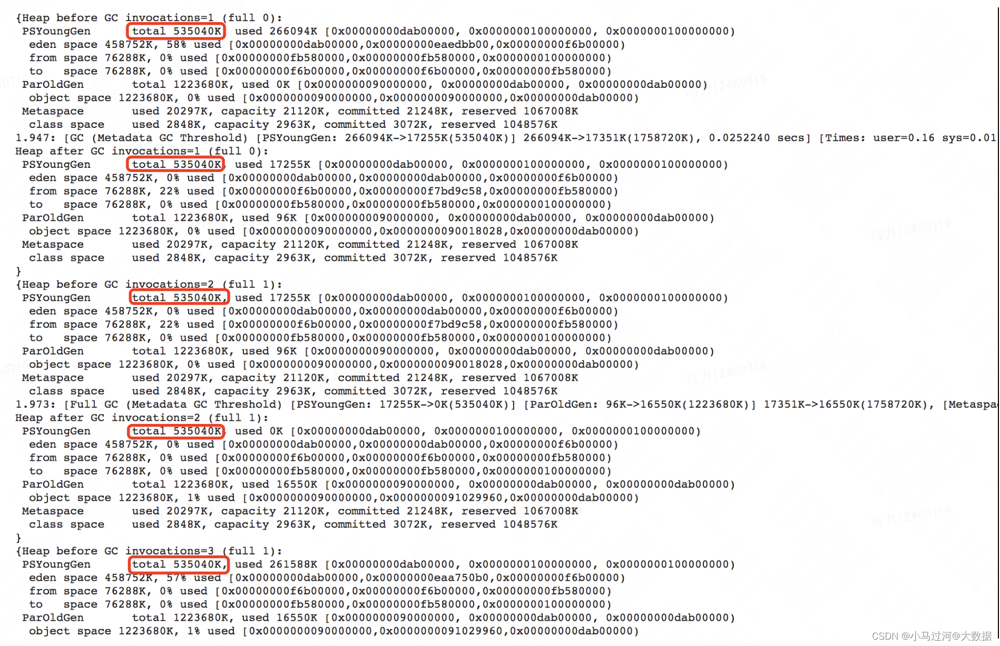
      ```.text
       此时我们可以算一下，eden+from+oldgen=458752+76288+1223680=1758720kib
       storage memory=（1758720/1024-300）*0.6=（1717.5-300）*0.6=1417.5*0.6=850.5
       可以说是一点都不差！
      ```

- [SQL]()
  ```.text
   sql页面的列表页罗列了提交到spark的所有sql，所有设置的参数，以及所有的创建临时函数的语句
  ```
  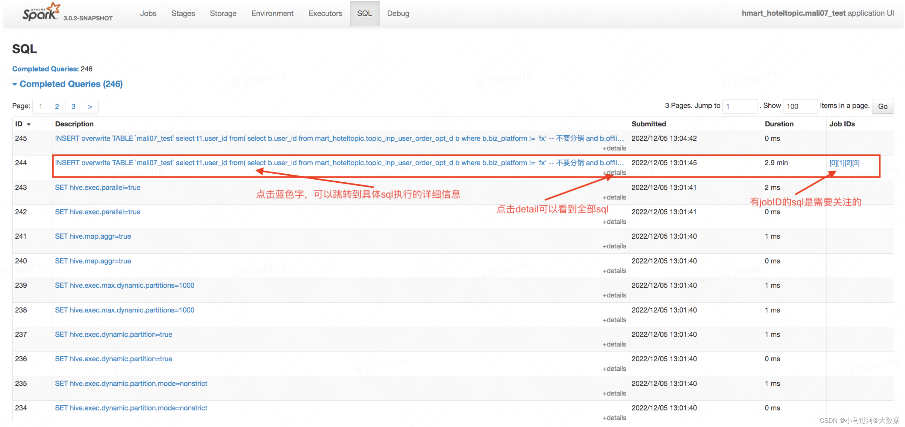
  > 点击蓝色字体sql语句会跳转到详情页，详情页分为DAG图和sql执行计划 <br>
  ```.text
   DAG图，以图形的形式展示了整个作业的执行过程，每个色块代表了一种算子，WholeStageCodeGen是用动态代码生成的方式把几个算子转换成java函数，提升计算效率。鼠标在算子的色块上悬停，可以看到更为详细的信息
  ``` 
  
  ```.text
   每个算子都会展示一些matrics，基本上也是见名知意的，就不再过多阐述，对于排查问题是很好的助力，附上官网的链接：SQL Metrics
   sql执行计划，包括Parsed Logical Plan、Analyzed Logical Plan、Optimized Logical Plan、Physical Plan
  ``` 
  
    - [关于SQL页面的问题]()
      > 如何从stage的DAG图关联到SQL的DAG图 ？<br>
      ```.text
       在spark2.x可以通过coordinatorid来关联，spark3可以勾选stageid，也可用用过WholeStageCodeGen后面的数字来关联。）
      ```
      > 查看SQL的DAG有什么值得关注的 ？<br>

      > 1.判断是否谓词下推 <br>
      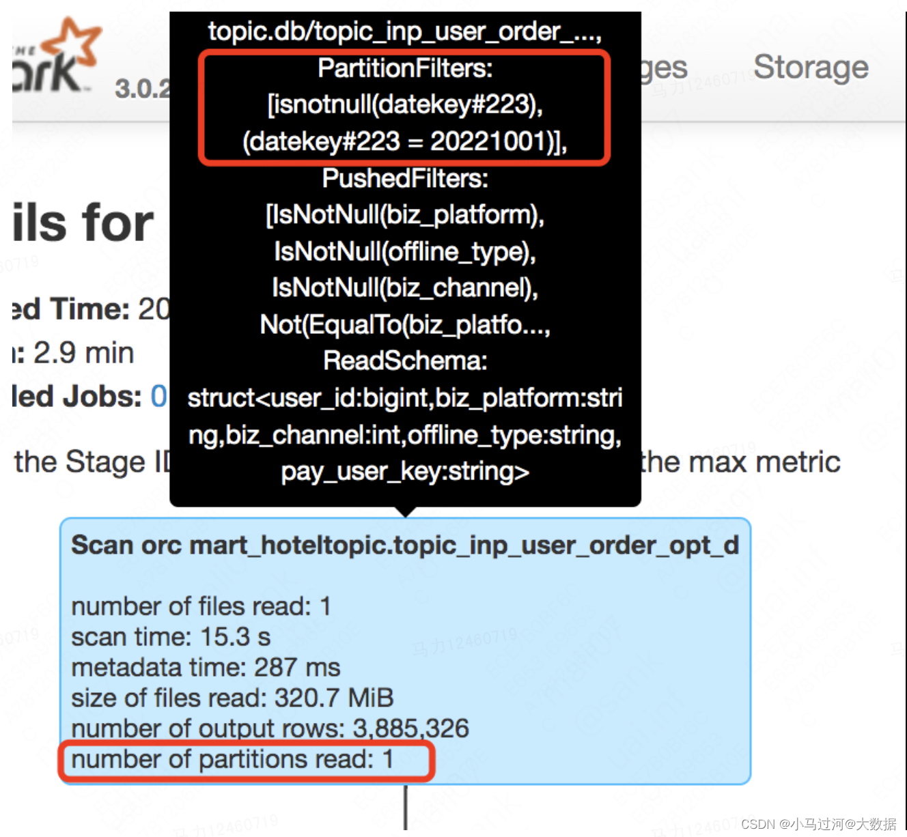

      > 2.判断join的方式，是SortMergeJoin还是broadcast join <br>
      

      > 3.判断各类操作下，有没有数据和时间倾斜 <br>
      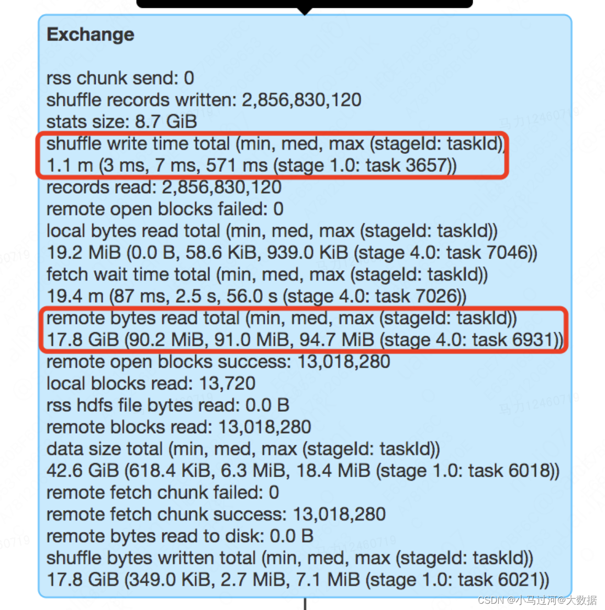

      > 4.怀疑有数据膨胀时，可以定位分析 <br>
      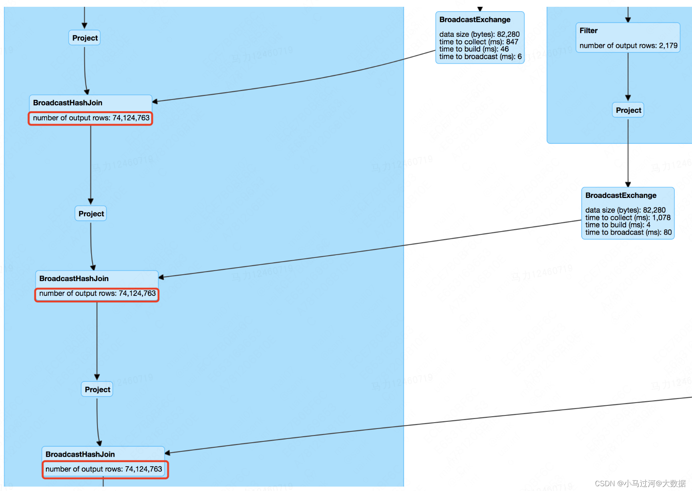

- [Debug]()
  ```.text
   为方便用户查看任务执行期间申请的Executor数量，Spark UI增加了Debug页面。
   Debug页面目前包括错误诊断信息以及不同类型Executor的时间线图。
   其中对应的Executor个数含义：
   1.requestedTotalExecutors: 当前时间点已经提交申请的executor个数，包括已申请到的numExistingExecutors 和 未申请到的numPendingExecutors.
   2.numExistingExecutors：当前时间点已经申请到的executor个数，包括 空闲待回收的 executorsPendingToRemove 和 正在执行任务的 executorsActive.
   3.numPendingExecutors：当前时间点已经提交申请，未申请到等待资源的executor个数.
   4.executorsPendingToRemove：当前时间点等待回收的executor个数.
   5.executorsPendingLossReason：丢失的executors个数，常见原因如资源抢占强制kill掉.
   6.executorsActive：当前时间点有任务在执行的executor个数
   如果想看一个任务在不同时间点占用的executor数量，应该看numExistingExecutors数量，需要注意的是executor数量并不能等同于CU的用量，
   一方面是一个executor可能占用更多内存换算成CU会占用更多的CU，还可能是一个executor会占用多个core（通过设置spark.executor.cores）也会占用更多的CPU。
  ```
  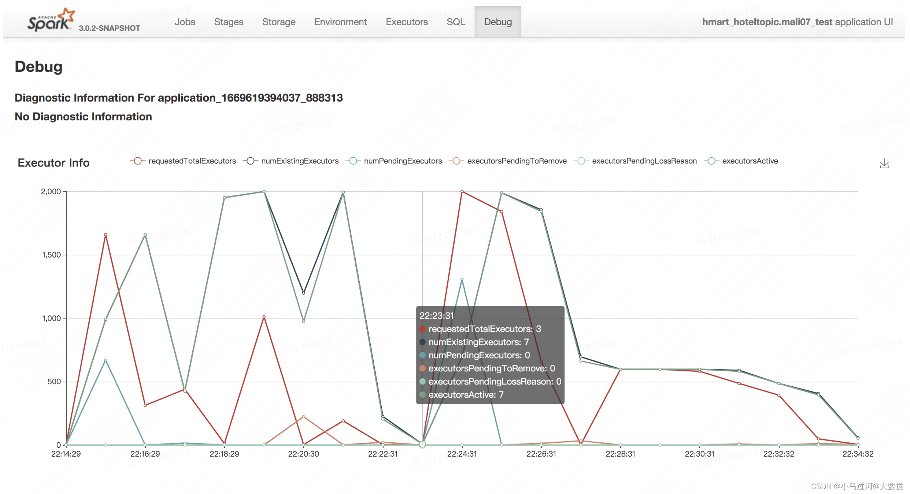


